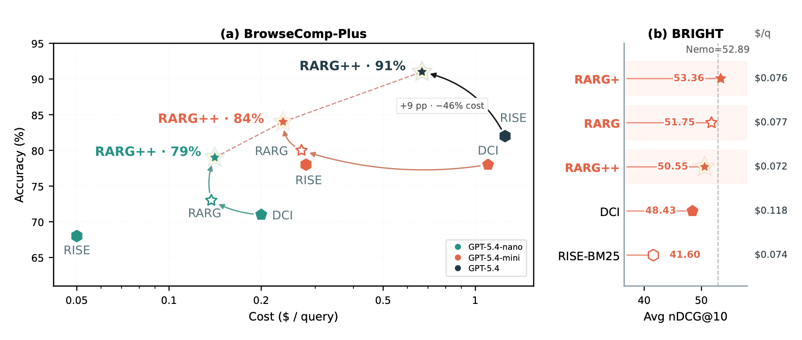
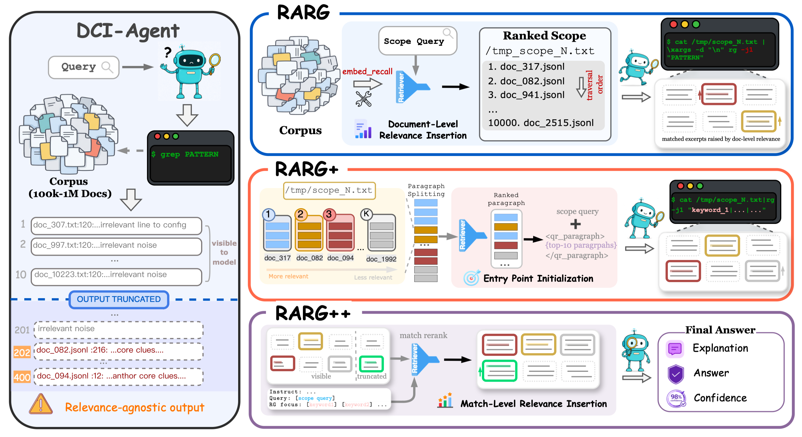
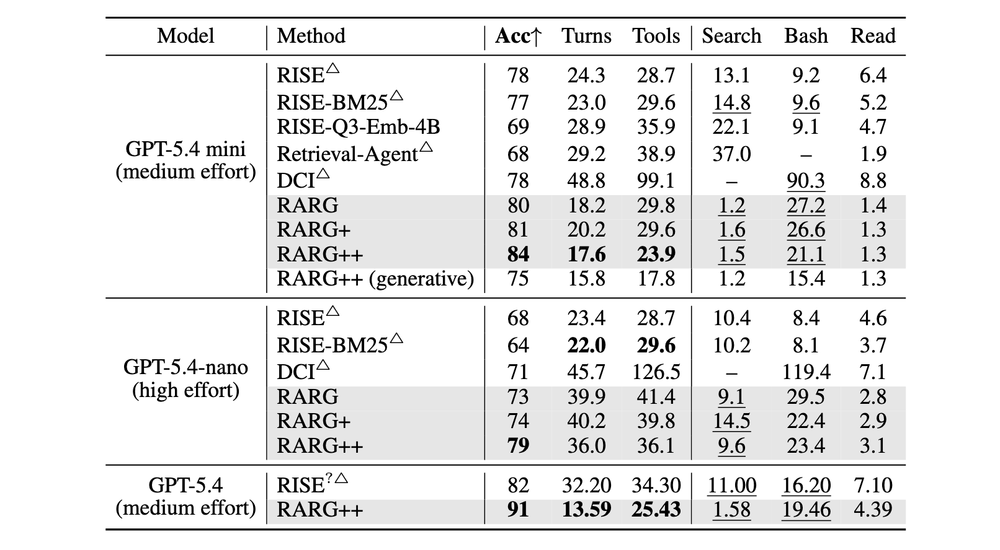
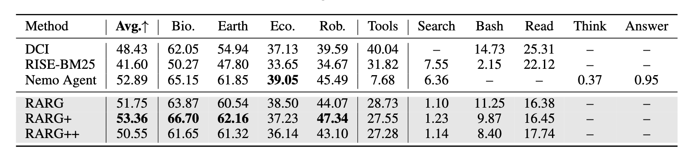

# Open-weight reproduction: relevance-guided corpus interaction

[](https://arxiv.org/abs/2607.24223)
[](https://molab.marimo.io/github/alphaXiv/rarg-79f3533d/blob/main/notebooks/rarg_reproduction.py)

**Verdict: partially reproduced.** We tested the paper's two central BrowseComp-Plus claims on the released 100K corpus: whether relevance-ordered `ripgrep` traversal exposes evidence earlier than relevance-agnostic direct corpus interaction, and whether paragraph entry points plus local match reranking add further gains. On the same 32 public questions, pooled Qwen3-8B open-judge accuracy rose from **3.1% DCI → 6.3% RARG → 12.5% RARG+ → 15.6% RARG++**, while mean tool steps fell from **3.22 → 1.84 → 1.50 → 1.53**. Exact-match controls were 3.1%, 3.1%, 3.1%, and 6.3%.

The strongest result is mechanistic: relevance moved the median gold document from corpus rank **25,912.5 to 154.5** (122× median speedup), and local reranking raised first-30 gold visibility from 15.6% to 21.9%. The answer gain was concentrated in the second fixed 16-question slice, so the direction is encouraging but not a full match to the paper's 78–84% result.

This bounded reproduction substituted Qwen3-8B for the proprietary GPT-5.4-mini-family agent and judge, Qwen3-Embedding-0.6B for relevance, and 32 of the paper's 100 questions; it omitted BRIGHT and the 1M corpus. Formal runs used **Kubernetes** on **NVIDIA RTX PRO 6000 Blackwell** GPUs, four GPUs per run, **16 GPUs peak concurrent**, and **1.225558 hours of observed Kubernetes campaign wall time**.

- [Read the illustrated tutorial-style report](reports/rarg-reproduction/report.md)
- [Explore the self-contained marimo notebook](notebooks/rarg_reproduction.py)
- [Inspect machine-readable results](results/summary.json)
- Exact public Molab URL: https://molab.marimo.io/github/alphaXiv/rarg-79f3533d/blob/main/notebooks/rarg_reproduction.py

## Paper number versus observed number

| Condition | Paper: accuracy / tool calls | Observed: judged / exact accuracy | Observed mean steps |
|---|---:|---:|---:|
| DCI | 78% / 99.1 | 3.1% / 3.1% | 3.22 |
| RARG | 80% / 29.8 | 6.3% / 3.1% | 1.84 |
| RARG+ | 81% / 29.6 | 12.5% / 3.1% | 1.50 |
| RARG++ | 84% / 23.9 | 15.6% / 6.3% | 1.53 |

## Experiment log

Every formal branch used the same committed Kubernetes manifest and the exact command shown below. Each run allocated four GPUs; four scientifically distinct runs were concurrent when the experiment round allowed it.

| Branch / experiment | Purpose or change | Exact run command | Assessment / outcome | Compute |
|---|---|---|---|---|
| `main` | Public report, notebook, figures, and reusable harness | Not run as an experiment (publication surface) | Presentation-only | — |
| [`orx/dci-rg-enabled-control`](https://github.com/alphaXiv/rarg-79f3533d/tree/orx/dci-rg-enabled-control) | DCI, rows 1–16 | `bash reproduction/run_k8s.sh` | 0% judged; 2.81 steps | Kubernetes, 4× RTX PRO 6000 Blackwell |
| [`orx/rarg-ordering-rg-enabled`](https://github.com/alphaXiv/rarg-79f3533d/tree/orx/rarg-ordering-rg-enabled) | Document ordering, rows 1–16 | `bash reproduction/run_k8s.sh` | 0% judged; 1.56 steps | Kubernetes, 4× RTX PRO 6000 Blackwell |
| [`orx/rarg-plus-seeding-rg-enabled`](https://github.com/alphaXiv/rarg-79f3533d/tree/orx/rarg-plus-seeding-rg-enabled) | Paragraph entry points, rows 1–16 | `bash reproduction/run_k8s.sh` | 0% judged; 12.5% evidence recall | Kubernetes, 4× RTX PRO 6000 Blackwell |
| [`orx/narrow-local-rerank-pool`](https://github.com/alphaXiv/rarg-79f3533d/tree/orx/narrow-local-rerank-pool) | 120-match local reranking, rows 1–16 | `bash reproduction/run_k8s.sh` | 0% judged; 12.5% evidence recall | Kubernetes, 4× RTX PRO 6000 Blackwell |
| [`orx/dci-second-16-query-slice`](https://github.com/alphaXiv/rarg-79f3533d/tree/orx/dci-second-16-query-slice) | DCI, rows 17–32 | `bash reproduction/run_k8s.sh` | 6.3% judged; 3.63 steps | Kubernetes, 4× RTX PRO 6000 Blackwell |
| [`orx/rarg-ordering-second-16-query-slice`](https://github.com/alphaXiv/rarg-79f3533d/tree/orx/rarg-ordering-second-16-query-slice) | Document ordering, rows 17–32 | `bash reproduction/run_k8s.sh` | 12.5% judged; 2.13 steps | Kubernetes, 4× RTX PRO 6000 Blackwell |
| [`orx/rarg-plus-second-16-query-slice`](https://github.com/alphaXiv/rarg-79f3533d/tree/orx/rarg-plus-second-16-query-slice) | Paragraph entry points, rows 17–32 | `bash reproduction/run_k8s.sh` | 25.0% judged; 1.81 steps | Kubernetes, 4× RTX PRO 6000 Blackwell |
| [`orx/narrow-rarg-plus-plus-second-slice`](https://github.com/alphaXiv/rarg-79f3533d/tree/orx/narrow-rarg-plus-plus-second-slice) | 120-match local reranking, rows 17–32 | `bash reproduction/run_k8s.sh` | 31.3% judged; 1.69 steps | Kubernetes, 4× RTX PRO 6000 Blackwell |
| [`orx/paired-relevance-mechanism-diagnostic`](https://github.com/alphaXiv/rarg-79f3533d/tree/orx/paired-relevance-mechanism-diagnostic) | Gold-rank and early-evidence diagnostic, rows 1–16 | `bash reproduction/run_k8s.sh` | 43.9× median rank speedup; reranking doubled top-30 visibility | Kubernetes, 4× RTX PRO 6000 Blackwell |
| [`orx/mechanism-diagnostic-second-slice`](https://github.com/alphaXiv/rarg-79f3533d/tree/orx/mechanism-diagnostic-second-slice) | Gold-rank and early-evidence diagnostic, rows 17–32 | `bash reproduction/run_k8s.sh` | 305.6× median rank speedup; top-30 visibility 25.0%→31.3% | Kubernetes, 4× RTX PRO 6000 Blackwell |

The default public configuration runs the bounded RARG++ condition on rows 1–16. Change only committed `reproduction/config.json` to recreate another condition, then launch with `orx exp run --backend k8s`; formal experiment branches preserve the exact configurations used above.

---

# RARG: Relevance-Aware RGrep Search

Official code for the paper **"A New Role for Relevance: Guiding Corpus Interaction in Agentic Search"**.

<p align="center">
<a href="https://arxiv.org/abs/2607.24223"></a>
<a href="https://qdcassie-li.github.io/RARG/"></a>
</p>

<p align="center">

</p>
<p align="center"><sub>Accuracy/nDCG@10 versus interaction cost (average tool calls) on BrowseComp-Plus and BRIGHT. By turning relevance into an execution prior over rg exploration, RARG advances the accuracy--efficiency frontier over retrieval-based and direct-interaction agents.</sub></p>

## About the paper

**Motivation.** Search agents use relevance in two ways, and both fall short. Top-$k$ retrieval agents rank the corpus and feed the model a fixed set of documents or snippets — this tells the agent *which* documents may matter, but not where the decisive evidence lies, and a single ranked view cannot localize, connect, or verify clues across documents. Direct Corpus Interaction (DCI) instead lets the agent explore raw documents with terminal tools like `grep`, which is far more fine-grained — but it scans blindly, treating every location as equally promising, so useful clues surface late and the agent burns many turns before converging. Our key observation: **relevance should guide the interaction itself, not merely select its inputs.**

<p align="center">

</p>
<p align="center"><sub>Overview of the RARG method.</sub></p>

**Method.** RARG turns retrieval into an *execution prior* for `grep`-style search, applied at two resolutions:

- **RARG** — Given an agent-issued query, an embedding retriever ranks the corpus, and `rg` then traverses documents *in that relevance order* (via a single-threaded, path-ordered scan). Matches from more relevant documents surface first, turning document-level relevance into search order rather than top-$k$ content selection.
- **RARG+** — Additionally seeds the agent with a few query-relevant paragraphs as an *entry point*, so it can form a precise first search instead of probing blindly from the question alone.
- **RARG++** — Additionally *reranks* a wider pool of `rg` matches by combining the global query with the local search intent, letting locally informative excerpts — including those in lower-ranked documents — compete for the model's limited observation budget.

Together, the three levels decide where interaction begins, which documents `rg` visits first, and which local matches reach the model — helping the agent reach evidence earlier and converge with fewer wasted steps, while keeping DCI's fine-grained interaction.

**Results.** On BrowseComp-Plus (100 queries), RARG++ reaches 84% accuracy vs. 78% for RISE/DCI (GPT-5.4-mini) with far fewer tool calls; on 4 subsets used by DCI in BRIGHT, RARG+ achieves 53.36 avg nDCG@10, surpassing DCI, RISE, and NeMo.

<p align="center">

</p>
<p align="center"><sub>BC+ results (BrowseComp-Plus, 100 queries)</sub></p>

<p align="center">

</p>
<p align="center"><sub>BRIGHT results (nDCG@10)</sub></p>

## About this repo

RARG is a Python reimplementation of the [pi-mono](https://github.com/earendil-works/pi/tree/main/packages/coding-agent)-style agent used in [DCI-Agent-Lite](https://github.com/DCI-Agent/DCI-Agent-Lite), on top of which we build our own method modifications. We mirrored the original TypeScript codebase and reimplemented it in Python.

## Included components

### 1. Core agent code

- `scripts/ts_mirror_agent/`
- `scripts/ts_mirror_agent_bright/`
- `scripts/model_server.py`
- `scripts/model_server_bright.py`
- `scripts/embed_recall.py`
- `scripts/embedding_backends.py`

### 2. Prompt files

- `prompts/bcplus/`
- `prompts/bright/`

### 3. Included small/medium data files

- `data/bcplus_qa.jsonl`
- `data/bcplus_qa_sample100.jsonl`
- `data/bright/queries/`
- `data/bright/docs/`
- `data/indices/bc_plus_1m/paths.json` — a JSON array of file-path strings listing the FineWeb-Edu documents sampled to build the 1M-scale corpus (i.e., which FineWeb-Edu data was included).

### 4. BC+ data construction / evaluation scripts

- `scripts/bcplus_eval/`
  - includes `scripts/bcplus_eval/judge_results.py` for **DCI-style only** LLM-as-judge evaluation
- `scripts/sra_bench/` (curated BC+ run scripts only)
  - retained variants: `no_rerank`, `embed_emb_only_20`, `embed_emb_only_50`, `bash_emb20_emb_rg`
  - correspondence to the paper's methods: **RARG** = `*_no_rerank`, **RARG+** = `*_embed_emb_only_*`, **RARG++** = `*_bash_emb20_emb_rg`
  - retained scales / model presets:
    - `100k`:
      - `gpt-5.4-mini`: all 4 variants
      - `gpt-5.4-nano`: all 4 variants
      - `gpt-5.4`: `bash_emb20_emb_rg` only
    - `1m`: `gpt-5.4-mini` only

### 5. BRIGHT run / evaluation scripts

- `scripts/bright/`
- `scripts/prepare_bright_corpus.sh`

### 6. Index building / merging scripts

- `scripts/build_embedding_index.py`
- `scripts/build_index*.sh`
- `scripts/merge_embedding_indices.py`
- `scripts/merge_indices_to_bcplus_1m.sh`

### 7. Environment / packaging files

- `activate.sh`
- `local-tools/README.md` (documents the DCI-style local binary workaround for Node 20 / ripgrep)
- `pyproject.toml`
- `LICENSE`

## Quick start

```bash
cd RARG
uv sync
source activate.sh
export OPENAI_API_KEY=...                # required
# export OPENAI_BASE_URL=...             # optional for compatible providers
```

For a fuller DCI-style environment check / data bootstrap, you can also run:

```bash
bash setup.sh
```

If your machine does not provide a usable system `node` / `rg`, see:

- `local-tools/README.md`

It documents the exact Node and ripgrep versions used in the DCI-style  
workaround and how to mirror that pattern locally.

If you use local / self-hosted models for retrieval, place them under `RARG/models/` or override the relevant script variables such as `EMBED_MODEL_PATH`, `QR_MODEL_PATH`, and `RG_EMBED_MODEL_PATH`.

## End-to-end BC+ workflow

The most useful way to read this repo is usually as the following pipeline:

1. **prepare environment**
2. **prepare benchmark data**
3. **prepare corpus**
4. **construct `bc_plus_100k` or `bc_plus_1m`**
5. **build FAISS index**
6. **run TS-Mirror agent**
7. **run DCI-style LLM-as-judge**

### A. Environment

```bash
cd RARG
uv sync
source activate.sh
export OPENAI_API_KEY=...
# export OPENAI_BASE_URL=...
```

If you want the DCI-style bootstrap checks too:

```bash
bash setup.sh
```

### B. Benchmark data

For BC+ evaluation, the repo already includes:

- `data/bcplus_qa.jsonl`
- `data/bcplus_qa_sample100.jsonl`

If you want to regenerate them from the original gated benchmark release:

```bash
uv run python scripts/download_dci_bench.py
uv run python scripts/bcplus_eval/extract_bcplus_qa.py
```

### C. Corpus

To download and export the DCI corpus bundle:

```bash
uv run python scripts/download_corpus.py
```

This is the DCI-style path that gives you:

- raw BrowseComp-Plus under `corpus/browsecomp_plus`
- exported docs under `corpus/bc_plus_docs`

### D. Construct `bc_plus_100k`

For the copied TS-Mirror sample100 scripts, the expected retrieval corpus is  
`corpus/bc_plus_100k`.

**Shortcut — download the ready-made 100K corpus.** Instead of running steps C  
and D yourself, you can directly download the pre-built corpus from  
[`lossisnotanumber/browsecomp-plus-100k-corpus-as-local-folder`](https://huggingface.co/datasets/lossisnotanumber/browsecomp-plus-100k-corpus-as-local-folder)  
and place it under `corpus/`:

```bash
hf download lossisnotanumber/browsecomp-plus-100k-corpus-as-local-folder \
  bc_plus_100k.zip --repo-type dataset --local-dir corpus
unzip corpus/bc_plus_100k.zip -d corpus
```

This yields `corpus/bc_plus_100k/<domain>/<title>.txt` (100,195 files), which is  
exactly the layout the run scripts expect. Then continue from step E (index building).

Alternatively, build it from the raw release in the DCI-compatible way with:

```bash
uv run python scripts/bcplus_eval/create_100k_corpus.py \
  --source-browsecomp "$PWD/corpus/browsecomp_plus" \
  --output "$PWD/corpus/bc_plus_100k" \
  --force
```

If you only have an already-exported `corpus/bc_plus_docs`, you can also do:

```bash
uv run python scripts/bcplus_eval/create_100k_corpus.py \
  --source-docs "$PWD/corpus/bc_plus_docs" \
  --output "$PWD/corpus/bc_plus_100k" \
  --force
```

### E. Build the 100K index

```bash
bash scripts/build_index.sh
```

This writes the index to:

- `data/indices/bc_plus_100k/index.faiss`
- `data/indices/bc_plus_100k/paths.json`

### F. Run a 100K TS-Mirror sample100 experiment

Pick the script matching the paper method you want to run  
(`no_rerank` = RARG, `embed_emb_only_*` = RARG+, `bash_emb20_emb_rg` = RARG++).  
Example (RARG++):

```bash
bash scripts/sra_bench/run_bcplus_100k_ts_mirror_agent_bash_emb20_emb_rg.sh
```

This writes outputs under:

- `outputs/bcplus_eval/<run_name>/`

Each query directory will contain artifacts such as:

- `item.json`
- `state.json`
- `conversation.json`
- `final.txt`
- later `eval_result.json` after judging

### G. Judge with DCI-style LLM-as-judge

For the common **sample100 + gpt-5.1** case:

```bash
python scripts/bcplus_eval/judge_results.py \
  --output-dir outputs/bcplus_eval/<run_name> \
  --dataset data/bcplus_qa_sample100.jsonl \
  --judge-model gpt-5.1
```

This writes:

- per-query `eval_result.json`
- top-level `judge_summary.json`

### H. 1M workflow

If you want the 1M corpus/index path instead, the flow is analogous:

1. prepare FineWeb sample + corpus + index
2. run one of the `scripts/sra_bench/run_bcplus_1m_ts_mirror_agent_*.sh` scripts
3. judge with the same `scripts/bcplus_eval/judge_results.py`

The helper entrypoint is:

```bash
bash scripts/build_index_bcplus_1m.sh
```

## DCI compatibility included in RARG

RARG now bundles the minimal `dci.benchmark` exporter modules needed by the copied corpus-preparation scripts:

- `dci.benchmark.export_bc_plus_docs`
- `dci.benchmark.export_bright_docs`

This means the following DCI-style commands work inside RARG after `uv sync` / `source activate.sh`:

```bash
uv run dci-export-bc-plus-docs --source-dir "$PWD/corpus/browsecomp_plus" --output-dir "$PWD/corpus/bc_plus_docs"
uv run dci-export-bright-docs --source-root "$PWD/corpus/bright_corpus_raw" --output-root "$PWD/corpus/bright_corpus"
```

The included `setup.sh` also ports the important DCI-style environment/data checks for:

- `corpus/browsecomp_plus`
- `corpus/bc_plus_docs`
- `corpus/bright_corpus/*/.dci_export_complete`
- `data/dci-bench`
- `data/bcplus_qa.jsonl`

## Data / corpus preparation

To prepare benchmark data by hand:

```bash
uv run python scripts/download_dci_bench.py
uv run python scripts/bcplus_eval/extract_bcplus_qa.py
```

To prepare corpus data by hand:

```bash
uv run python scripts/download_corpus.py
```

To get the **TS-Mirror 100K** corpus, the easiest way is to download the  
pre-built zip from  
[`lossisnotanumber/browsecomp-plus-100k-corpus-as-local-folder`](https://huggingface.co/datasets/lossisnotanumber/browsecomp-plus-100k-corpus-as-local-folder)  
and extract it into `corpus/` (see the shortcut in step D of the end-to-end workflow).

To instead build it in the DCI-compatible way, use the DCI  
exporter-backed helper below. It prefers raw `corpus/browsecomp_plus` input and  
writes a real-file corpus tree into `corpus/bc_plus_100k`:

```bash
uv run python scripts/bcplus_eval/create_100k_corpus.py \
  --source-browsecomp "$PWD/corpus/browsecomp_plus" \
  --output "$PWD/corpus/bc_plus_100k" \
  --force
```

If you already have `corpus/bc_plus_docs`, the same helper can also copy from  
that exported tree:

```bash
uv run python scripts/bcplus_eval/create_100k_corpus.py \
  --source-docs "$PWD/corpus/bc_plus_docs" \
  --output "$PWD/corpus/bc_plus_100k" \
  --force
```

If you only downloaded raw BrowseComp-Plus parquet files, export them into the DCI-compatible document tree with:

```bash
uv run dci-export-bc-plus-docs \
  --source-dir "$PWD/corpus/browsecomp_plus" \
  --output-dir "$PWD/corpus/bc_plus_docs"
```

If you only downloaded BRIGHT parquet files, export them with:

```bash
uv run dci-export-bright-docs \
  --source-root "$PWD/corpus/bright_corpus_raw" \
  --output-root "$PWD/corpus/bright_corpus"
```

## Important note for TS-Mirror sample100 runs

The copied `scripts/sra_bench/run_bcplus_*ts_mirror_agent*.sh` scripts expect these assets to already exist:

- `corpus/bc_plus_100k`
- `data/indices/bc_plus_100k/index.faiss`

And the 1M variants expect:

- `corpus/bc_plus_1m`
- `data/indices/bc_plus_1m/index.faiss`

These large experiment assets are not shipped in the repo. `setup.sh` will now warn if they are missing, but it does not fabricate them automatically.

To judge a finished BC+ run with the copied DCI-style evaluator:

```bash
python scripts/bcplus_eval/judge_results.py \
  --output-dir outputs/bcplus_eval/<run_name> \
  --dataset data/bcplus_qa.jsonl \
  --judge-model gpt-5.4
```

`judge_results.py` reads `OPENAI_BASE_URL` / `OPENAI_API_KEY` by default and writes per-query `eval_result.json` files plus a top-level `judge_summary.json`.

For the common **sample100** setting, if you want to evaluate with **gpt-5.1**, run:

```bash
cd RARG
export OPENAI_API_KEY=...
# export OPENAI_BASE_URL=...   # optional for OpenAI-compatible providers

python scripts/bcplus_eval/judge_results.py \
  --output-dir outputs/bcplus_eval/<run_name> \
  --dataset data/bcplus_qa_sample100.jsonl \
  --judge-model gpt-5.1
```

This judge is **DCI-style only** and should be run on the local machine after the agent run has finished.

## Not included

The following large artifacts are still intentionally omitted from this repo copy  
(everything under `corpus/` is gitignored):

- full corpora under `corpus/`
  - the pre-built 100K corpus can be downloaded directly from  
    [`lossisnotanumber/browsecomp-plus-100k-corpus-as-local-folder`](https://huggingface.co/datasets/lossisnotanumber/browsecomp-plus-100k-corpus-as-local-folder)  
    and extracted into `corpus/bc_plus_100k` (see the shortcut in step D above)
- built indices under `data/indices/`
- very large FineWeb samples used for 1M corpus reconstruction

## Inventory

- Core components: agent code, prompts, benchmark data, corpus-preparation and  
  evaluation scripts, and index-building utilities (see the sections above).

## Outputs for reference (`outputs_for_demonstration`)

`outputs_for_demonstration/bcplus_eval/` contains agent run outputs on
BrowseComp-Plus (100-query sample) for a few model/recipe combinations.
Redundant files have been removed; for each sample we keep only:

- **all conversation turns** — the full per-turn content as the agent executed
  (compaction views are *not* shown), and
- **the final answer** produced by the agent.

We also keep the **scope file(s)**. The `gpt-5.4-nano` runs produced many of
them, so for those we kept only a single `scope_1.txt`.
