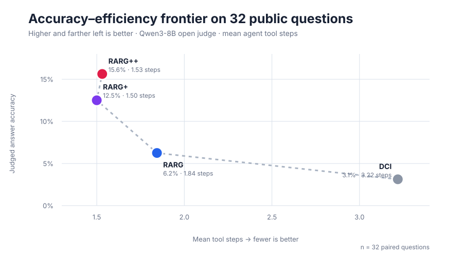
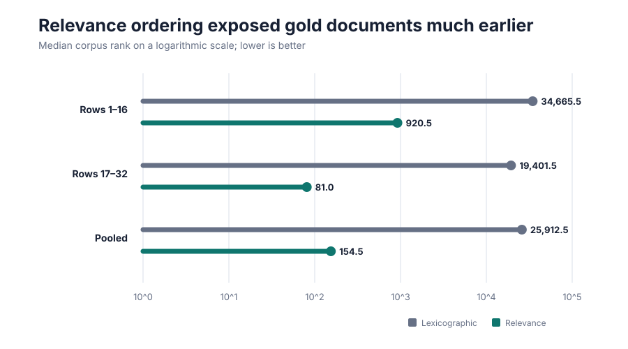
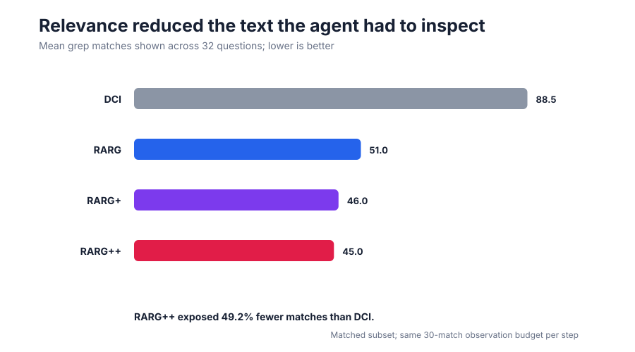
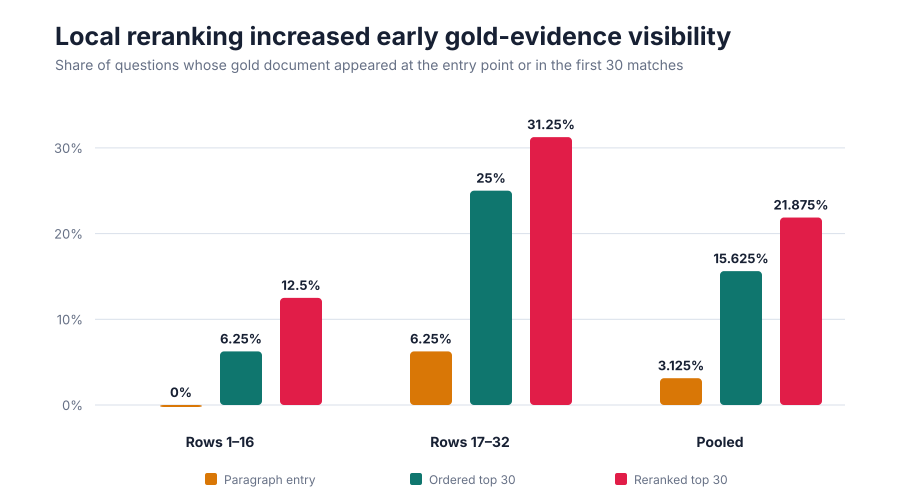
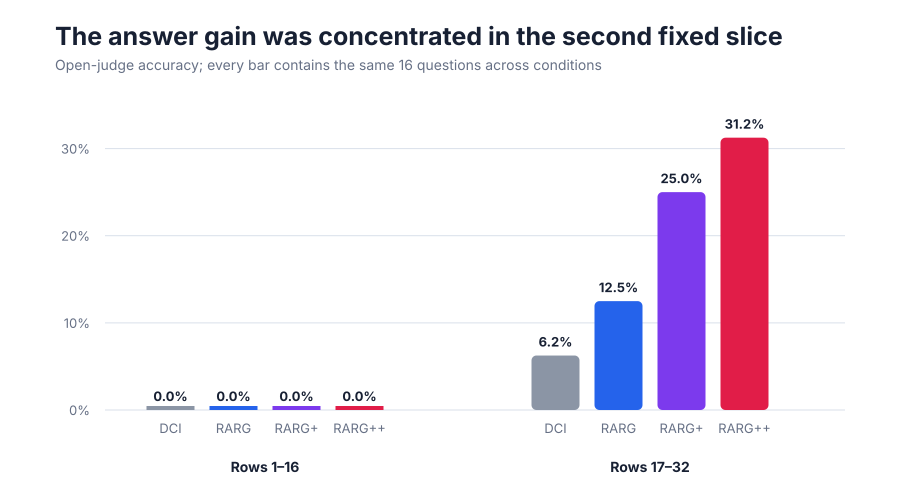

# Relevance as an execution prior: a 100K-corpus reproduction

Search agents often waste time because they inspect a large collection in an arbitrary order, even when a relevance model already knows which documents look promising. The paper *A New Role for Relevance* proposes using that signal to guide the search process itself: visit promising documents first, begin from promising paragraphs, and reorder local text matches before showing them to the agent. This reproduction tested whether those changes reveal evidence earlier and improve answers for the same interaction budget.

**Verdict — partially reproduced.** On 32 fixed public BrowseComp-Plus questions and the released 100K corpus, relevance-guided variants formed a better observed accuracy–efficiency frontier than direct corpus interaction. The mechanism and cost effects were strong, while the answer gains were small, slice-sensitive, and measured with open Qwen substitutes rather than the paper's proprietary agent and judge.

Read the figure upward for more correct answers and leftward for fewer search steps. DCI achieved 3.1% judged accuracy in 3.22 steps; document ordering reached 6.3% in 1.84, paragraph seeding reached 12.5% in 1.50, and narrow local reranking reached 15.6% in 1.53. Exact-match controls were 3.1%, 3.1%, 3.1%, and 6.3%, respectively, so the direction is clearer than the absolute accuracy claim.

## What was reproduced

The experiment used the public `DCI-Agent/corpus` BrowseComp-Plus parquet, exported all 100,195 documents, and selected the first 32 rows of the released 100-question sample. Every condition used the same Qwen3-8B agent and open judge, Qwen3-Embedding-0.6B relevance model, six-step limit, and deterministic query slices.

- **DCI:** relevance-agnostic ripgrep traversal.
- **RARG:** the same search with document traversal ordered by query relevance.
- **RARG+:** RARG plus eight query-relevant entry paragraphs.
- **RARG++:** RARG+ plus reranking of a bounded 120-match local pool.

Runs used Kubernetes on NVIDIA RTX PRO 6000 Blackwell GPUs, with four GPUs per condition and a peak of 16 concurrent GPUs. The successful evidence window was 2026-07-29 01:21:34–02:06:37 UTC: **0.751 wall hours**.

## Finding 1: document order changed when evidence arrived

The paired corpus diagnostic located each question's known gold document under lexicographic and relevance traversal. Across 32 questions, its median position moved from 25,912.5 to 154.5—a 122× median speedup. Relevance recall was 37.5% in the first 100 documents, 65.6% in the first 1,000, and 93.8% in the first 10,000.

This mechanism translated into less interaction. RARG exposed 51.0 matches per question versus DCI's 88.5; RARG++ exposed 45.0, a 49.2% reduction.

**Claim assessment: aligned under this setup.** The observed answer difference is modest, but earlier gold-document rank, higher evidence recovery (15.6% versus 3.1%), fewer matches, and fewer steps all point in the paper's predicted direction.

## Finding 2: entry points and local reranking added uneven gains

The direct evidence diagnostic distinguishes the two additions. Paragraph seeding itself exposed a gold document at entry for only 3.1% of questions. Among the first 30 grep matches, document ordering exposed gold evidence for 15.6%; local reranking raised this to 21.9%.

The answer hierarchy also appeared only in the second predetermined slice. All methods scored 0% on rows 1–16, although RARG+ and RARG++ recovered evidence on 12.5%. On rows 17–32, judged accuracy rose from 6.3% for DCI to 12.5% for RARG, 25.0% for RARG+, and 31.3% for RARG++.

**Claim assessment: partially aligned.** Paragraph seeding and narrow local reranking improved pooled judged accuracy beyond document ordering, and reranking improved direct early-evidence visibility. However, paragraph visibility was sparse, evidence recall did not increase from RARG+ to RARG++, and a wider 500-match reranking pool erased the first-slice evidence gain. These results support a bounded local reranker, not an unconditional benefit.

## Paper result versus observed result

| Condition | Paper accuracy / calls | Observed judged / exact accuracy | Observed steps |
|---|---:|---:|---:|
| DCI | 78% / 99.1 | 3.1% / 3.1% | 3.22 |
| RARG | 80% / 29.8 | 6.3% / 3.1% | 1.84 |
| RARG+ | 81% / 29.6 | 12.5% / 3.1% | 1.50 |
| RARG++ | 84% / 23.9 | 15.6% / 6.3% | 1.53 |

The paper used 100 questions, GPT-5.4-mini-family components, and its released evaluation path; this reproduction used 32 questions and Qwen3-8B for both acting and open judging. The small deterministic sample has no seed-based uncertainty estimate, and an agent that often answered after one weak clue produced much lower absolute accuracy. BRIGHT and the 1M corpus were not attempted. Accordingly, this is evidence for the ordering mechanism and its cost consequence, with only provisional evidence for the full answer-accuracy effect.

## Reuse the evidence

The [self-contained marimo notebook](../../notebooks/rarg_reproduction.py) embeds the measurements and explains every figure; it does not require rerunning the models. Open it directly at the exact public Molab URL:

The machine-readable aggregates are in [`results/summary.json`](../../results/summary.json), and the public harness is in [`reproduction/`](../../reproduction/). Each formal condition used the identical command `bash reproduction/run_k8s.sh` on Kubernetes.
